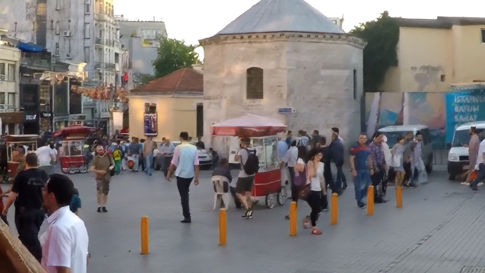
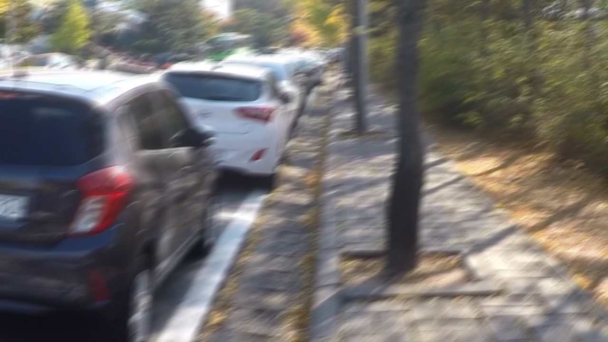
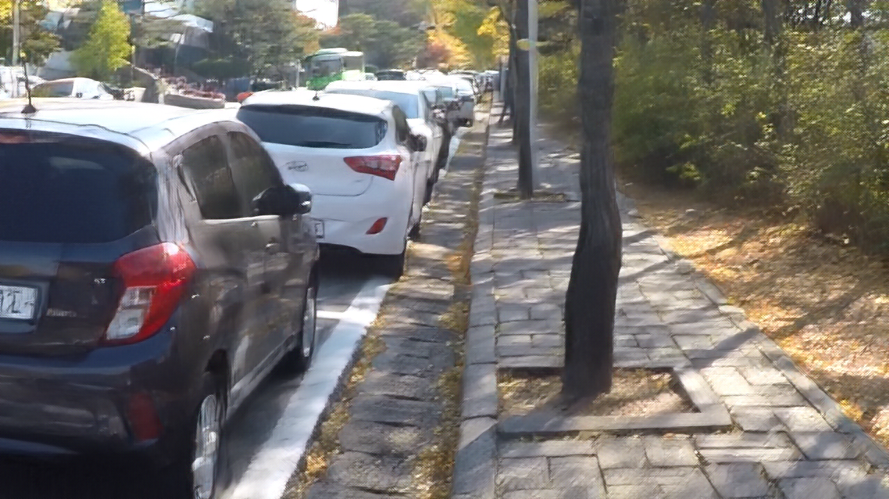
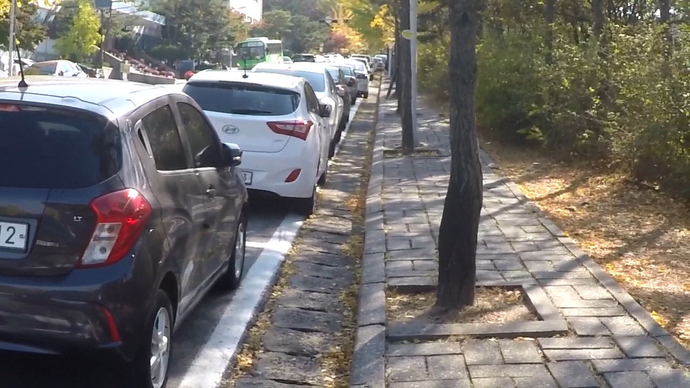
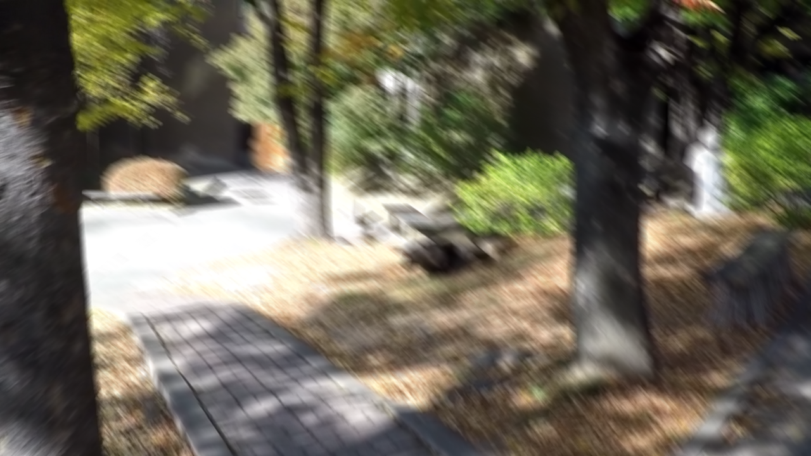
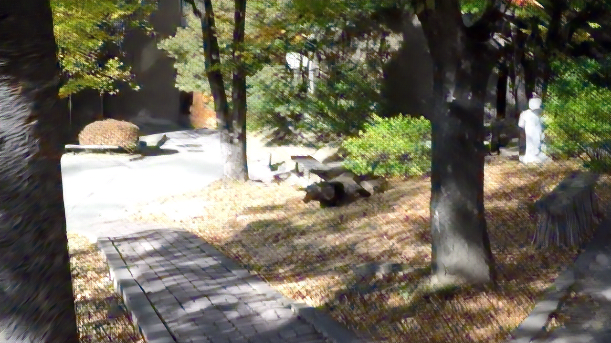
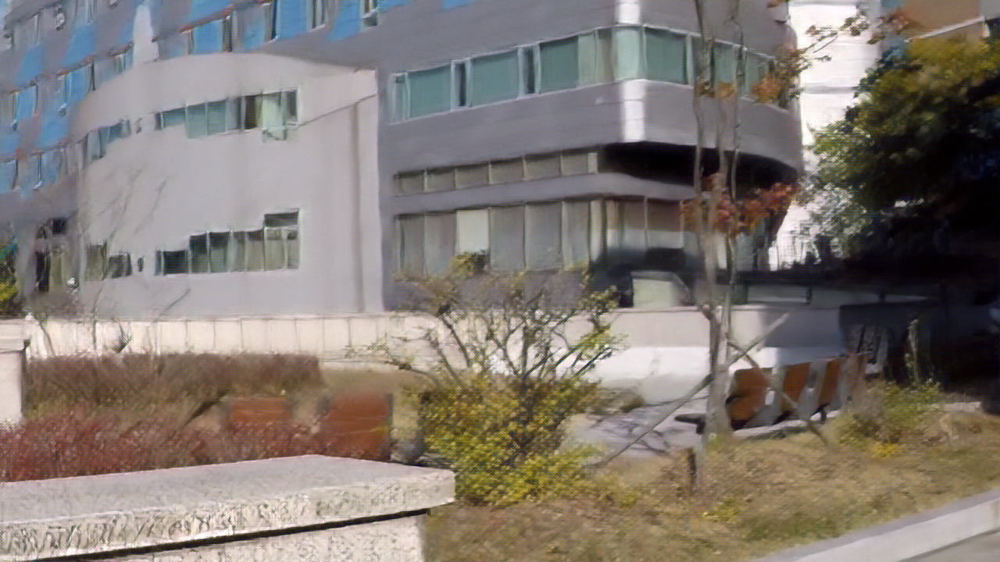
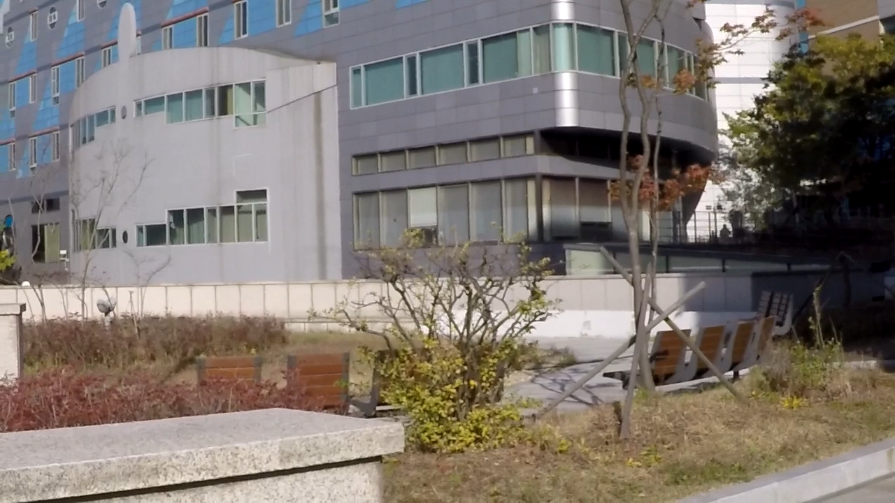
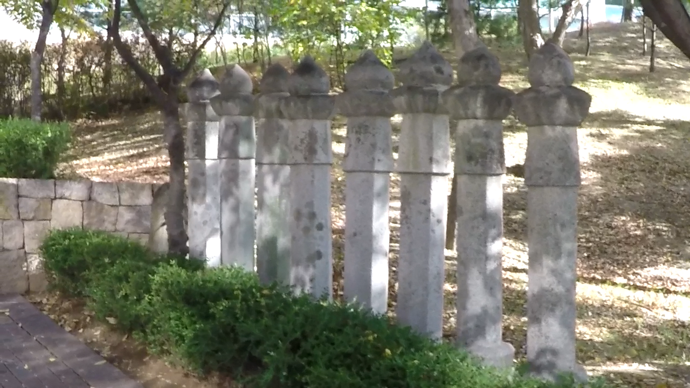
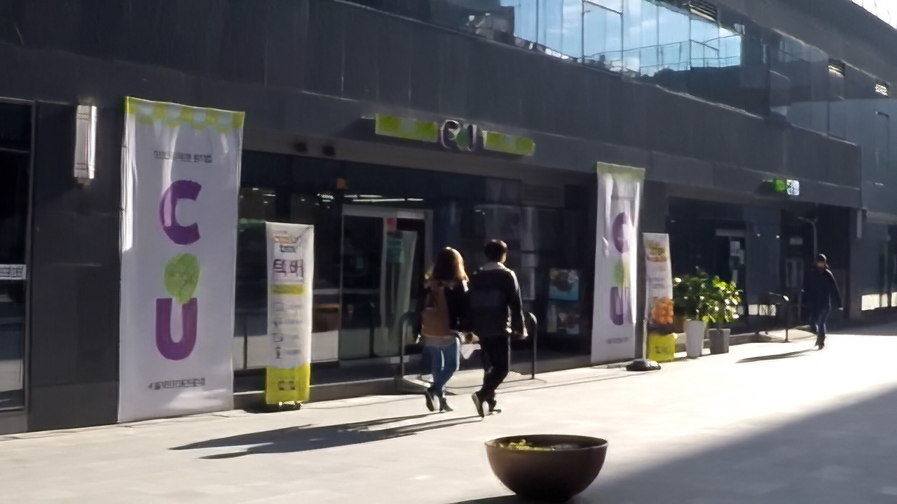

#  DeblurGAN : Blind Motion Deblurring Using Conditional Adversarial Networks
An implementation of DeblurGAN described in the paper using tensorflow.
* [ DeblurGAN : Blind Motion Deblurring Using Conditional Adversarial Networks](https://arxiv.org/abs/1711.07064)

Published in CVPR 2018, written by O. Kupyn, V. Budzan, M. Mykhailych, D. Mishkin and J. Matas

## Requirement
- Python 3.6.5
- Tensorflow 1.10.1 
- Pillow 5.0.0
- numpy 1.14.5
- Pretrained VGG19 file : [vgg19.npy](https://mega.nz/#!xZ8glS6J!MAnE91ND_WyfZ_8mvkuSa2YcA7q-1ehfSm-Q1fxOvvs) (for training!)

## Datasets
- [GOPRO dataset](https://github.com/SeungjunNah/DeepDeblur_release)

## Pre-trained model
- [GOPRO_model](https://drive.google.com/open?id=1Sg0LQUAsf3wfDQNMwUKKM2O-uJMWQWxw)

## Train using GOPRO dataset
1) Download pretrained VGG19 file
[vgg19.npy](https://mega.nz/#!xZ8glS6J!MAnE91ND_WyfZ_8mvkuSa2YcA7q-1ehfSm-Q1fxOvvs)

2) Download GOPRO dataset
[GOPRO dataset](https://github.com/SeungjunNah/DeepDeblur_release)

3) Preprocessing GOPRO dataset. 
```
python GOPRO_preprocess.py --GOPRO_path ./GOPRO/data/path --output_path ./data/output/path
```

4) Train using GOPRO dataset.
```
python main.py --train_Sharp_path ./GOPRO/path/sharp --train_Blur_path ./GOPRO/path/blur
```
## Train using your own dataset
1) Download pretrained VGG19 file 
[vgg19.npy](https://mega.nz/#!xZ8glS6J!MAnE91ND_WyfZ_8mvkuSa2YcA7q-1ehfSm-Q1fxOvvs)

2) Preprocess your dataset. Blur image and sharp image pair should have same index when they are sorted by name respectively. 

3) Train using GOPRO dataset.
```
python main.py --train_Sharp_path ./yourData/path/sharp --train_Blur_path ./yourData/path/blur
```

## Deblur your own images
1) Download pre-trained model. 
[pre_trained_model](https://drive.google.com/open?id=1Sg0LQUAsf3wfDQNMwUKKM2O-uJMWQWxw)

2) Unzip the pre-trained model file
```
tar -cvf DeblurGAN_model.tar
```
3) Deblur your own images
```
python main.py --mode test_only --pre_trained_model ./path/to/model --test_Blur_path ./path/to/own/images
```
4) If you have an out of memory(OOM) error, please you chop_forward option
```
python main.py --mode test_only --pre_trained_model ./path/to/model --test_Blur_path ./path/to/own/images --in_memory True --chop_forward True
```
## Experimental Results
Experimental results on GOPRO dataset

| Blur | Result | Ground Truth |
| --- | --- | --- |
|  | |  |
|  | |  |
|  | |  |
|  | |  |
|  | |  |
|  | |  |

## Comments
If you have any questions or comments on my codes, please email to me. [son1113@snu.ac.kr](mailto:son1113@snu.ac.kr)

## Reference
[1]. https://github.com/KupynOrest/DeblurGAN

[2]. https://github.com/machrisaa/tensorflow-vgg
* vgg19.py is fixed for my implementation.